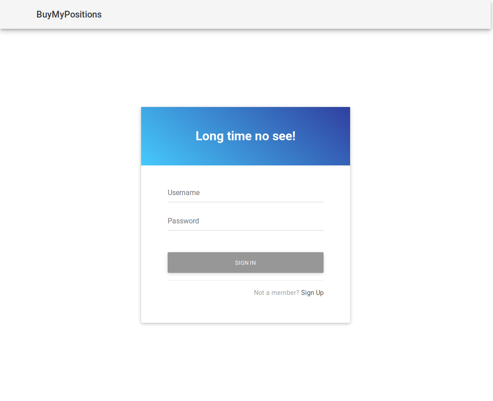
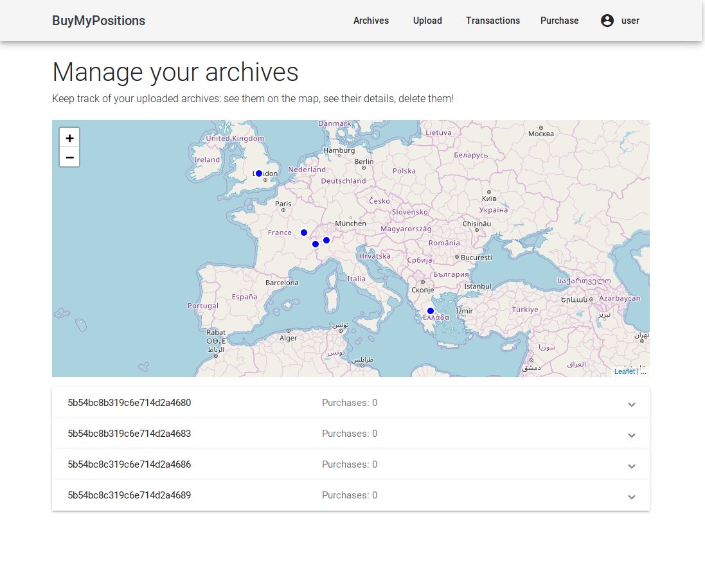
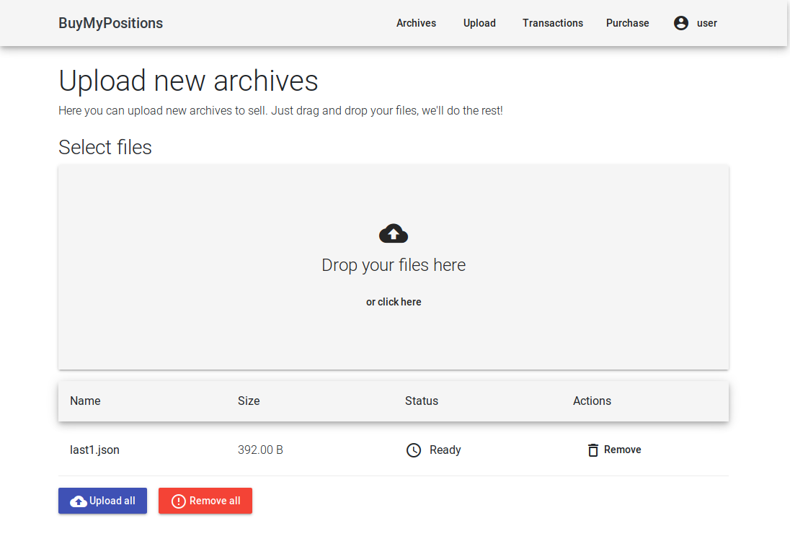
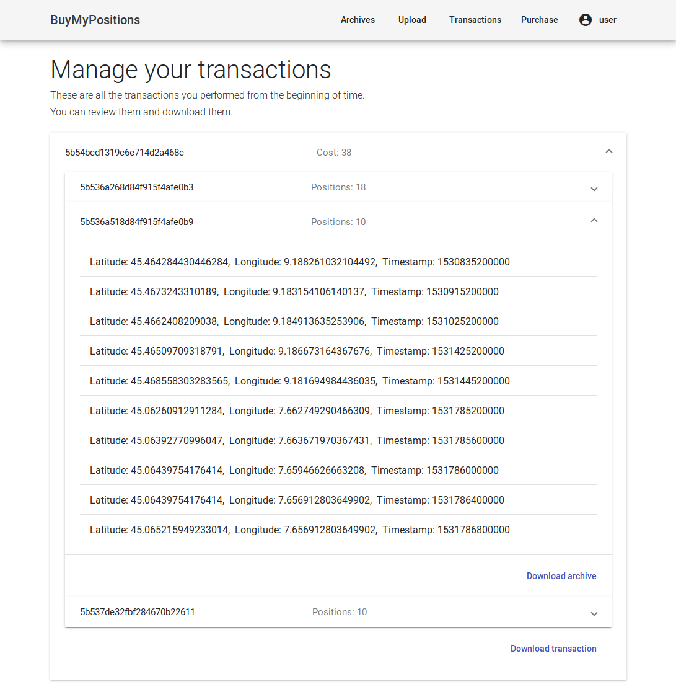
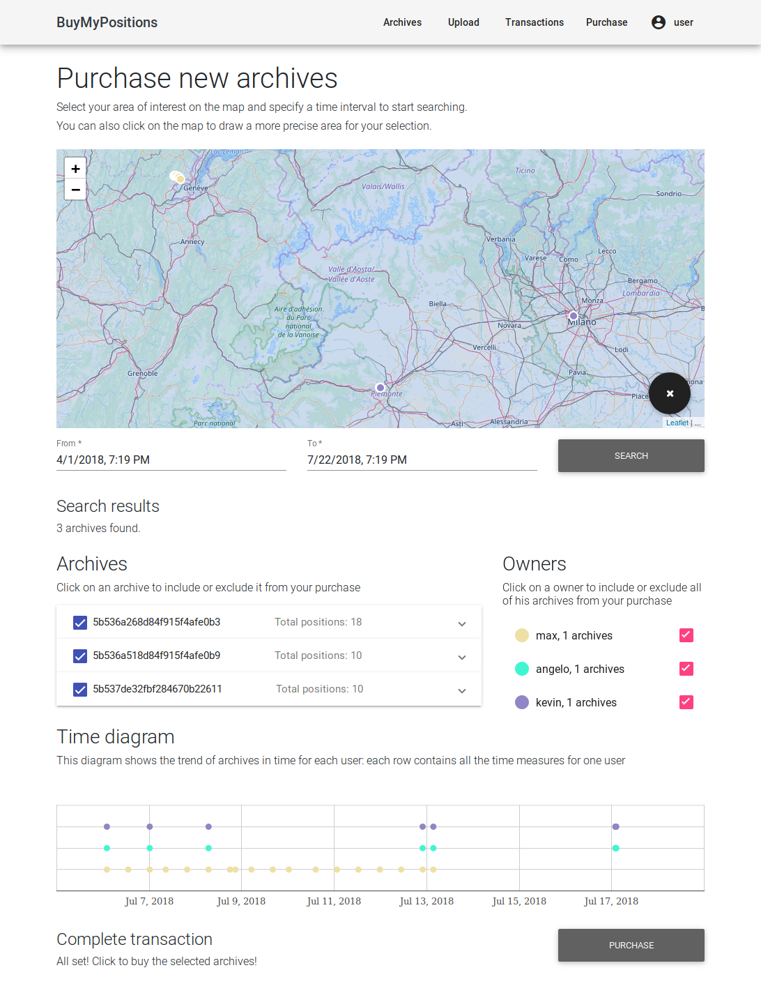

# BuyMyPositions.com

 

  

 

## Requirements
In your local environment you must have installed and correctly configured the following applications:
- `Maven` (4.0 at least)
- `JDK 9` (at least)
- `Docker` (CE or EE)

In order for the website to download libraries (e.g. Bootstrap) from the CDNs, an Internet connection is required.

## Description
In this page the web application developed during the Master Degree course _Applicazioni Internet_ at Politecnico di Torino. The assignment specification can be found [here](https://docs.google.com/document/d/1xU4IIYjcGWkvueMsQXFXWerTsabdzeJdzze8MdB6oaE/edit#heading=h.efn3ag6t5r6x).

The application works full-stack: it offers a Single Page Application frontend and exposes a REST API in the backend.

## How to build
In order to build the web application you simply run the shell script `build-all-and-run.sh`. If you are on a Windows OS, run `build-all-and-run.sh windows`.

After the first installation it is possible to backup the DB data. You can find more information about this procedure [here](./DockerCompose/docker_persistence/README.md)

## Web server REST API
The server exposes the following endpoints, some of them available only if a valid _JWT_ token is provided. To retrieve a token, it is enough to perform authentication through **OAuth2** using the standard endpoints.

#### User endpoints
- `GET` on `api/user` to get information about the user
- `POST` on `api/user/registration` to register a new user
    - request JSON body: `string username`, `string password`
- `GET` on `api/user/checkExistence` to check the existence of an username
    - parameters: `string username`

#### Archive endpoints
- `GET` on `api/archives` to get the approximated representations of positions
    - parameters: `string area` (an url-encoded representation of a GeoJsonPolygon), `long from`, `long to`
- `GET` on `api/archives/uploaded` to get all the archives uploaded by the user
- `POST` on `api/archives/uploaded` to upload archives
    - request JSON body: `array of positions` (i.e. latitude, langitude, timestamp) 
- `GET` on `api/archives/uploaded/{id}` to get the uploaded archive specified by `id` for that user
- `DELETE` on `api/archives/uploaded/{id}` to delete the uploaded archive specified by `id` for that user
- `GET` on `api/archives/bought` to get all the archives bought by the user
- `GET` on `api/archives/bought/{id}` to get the bought archive specified by `id` for that user

#### Transaction endpoints
- `POST` on `api/transactions` to buy the archives required in the id list, to create a Transaction, to update the customer bought archives and to update the user and the customer balance
    - request JSON body: `array of archive's id`
- `GET` on `api/transactions` to get all the transactions performed by the user

## Single Page Application
### How to start
After running the service, open the application from a browser on `localhost:8080`. Enjoy the wonderful descriptions and the beautiful faces of the authors.

On the top-right you can either **login** or **register**. After the login, all functionalities will be enabled.

### Archives
This page represents what the user has. It shows all the positions uploaded. It is possible to delete them.

### Upload
The interface accepts files containing a list of positions (latitude, longitude, timestamp). After a validity check, they will be uploaded on the server.

### Transactions
Here starts the fun. The user can see what he bought, and can enjoy the money he spent to have others' information. For each transaction, the user can download the archives.

### Purchase
Here IS the fun. There is a map, you scroll and draw on it, we give you hints on what we have. We won't provide the real positions, just something that can make you feel the power and spend the money. Seriously, _don't try to open the browser console, you won't find anything more :)_

After a search has been started, the data will be organized based on the geographical position, on the users, and on the timestamp. Fancy.

### Your name
Shows your balance, don't get scared.

Let's you log out of the application. Seriously _there is no reason to click on that button._

